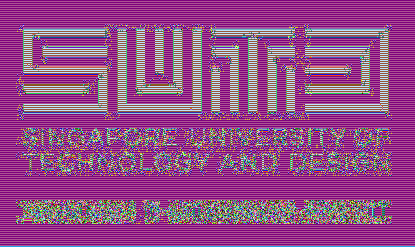

# Lab 5 - Encryption Lab

#### Koh Ting Yew, Davis - 1003339

## Part 1

**Code for Part 1 is located in `./DigitalSignatureSolution.java`.**

1. Yes, both files are printable.

   

2. I see weird symbols and gibberish. It is non-printable.

   

3. Yes. Base64 encoded is generally printable.

   

4. No. There is no key involved. It is used for encoding, and not for confidentiality purpose; anyone who is aware of the encoding will be able to decode it.

5. The output is the same as the input file.

6. A larger file gives a larger byte array. This is because a larger file has more bits for input, and thus there are more blocks, and more blocks encrypted means that the output will be correspondingly large as well when the encrypted blocks are reintegrated together.

   

## Part 2

**Code for Part is located in `desImageStartingCode.java` and `desImageStartingCodeFlipped.java`.**

1. Both encrypted image retains the dimensions of their original image. Furthermore, the contents such as the shape remains similar, except that the colour has been shifted.

   

   

2. `ECB` divides the input into independent blocks, that are individually encrypted. Therefore, identical blocks will be encrypted into identical byte arrays, that will be translated into the same pixels. In our code, it is such that every 2 adjacent pixels (column-wise, starting from top) is mapped into a block. So, if a 2-pixel cluster in the image is the exact same as another 2-pixel cluster somewhere else, then the encrypted output will be the same 2-pixel colour arrangement. Thus, it is almost as if you are merely colour shifting the image, especially pertinent in the images `SUTD.bmp` and `triangle.bmp` where solid colours are present in large quantities. 

3. The `CDC`-mode encrypted image for `SUTD.bmp`, stored in `CDC_SUTD.bmp`, is more jumbled up than `EDC_SUTD.bmp`. However, for `CDC_triangle.bmp`, it still remains obvious that the triangle is there, even though it is certainly more "complex looking". `CBC` is such that each input block is added-XOR to the previous encrypted block, before being encrypted itself. This creates a cascading effect where every block depends on the previous one. In our provided code, the creation of blocks is done systematically for every column of pixels, top-down. Each byte-array-column is then independently encrypted using `CBC` mode. This is why we see the "horizontal banding" effect as each row of pixels all have the same colour in the background portions of the image. 

   In the case of `CDC_SUTD.bmp`, the encryption outcome is better than with `ECB` mode because despite the presence of a "horizontal banding" effect that reveals that a solid colour background in the original image, this effect disappears at varying points within each column of pixel - the moment the encryption process encounters the top of the word *'SUTD'*. Consequently, the pixels will now appear different from its neighbouring pixels row-wise, and the randomness seeps in and makes the image way harder to decipher with naked eye.

   For `CDC_triangle.bmp`, because of the position and orientation of the triangle in the image, the transition from "horizontal banding" effect to random noise occurs very clearly along the sides of the triangle, allowing us to discern that a triangle was in the original non-encrypted image.

   

   

4. The issue I have with `CDC_SUTD.bmp` is that, as explained earlier my previous answer, you can tell that the original image has a background at the very least, due to the banding effect. This, coupled with the locations of where the banding effect stops, all provide clues as to the rough content of the image.

   With the bottom-up approach, the code which can be found in `desImageStartingCodeFlipped.java`, we have:

   

   

   The output images are `CBC_bottomup_SUTD.bmp` and `CBC_bottomup_triangle.bmp`.

   For the bottom-up approach: `CDC_bottomup_SUTD.bmp`, we can see a tremendous improvement compared to the top-down: `CDC_SUTD.bmp`. This is because at the bottom of `SUTD.bmp`, the words *'Established in collaboration with MIT'* are very fuzzy on the pixel level, compared to the sharp, perfectly horizontal edges that the big letters in *'SUTD'* makes. This fuzziness results in very minimal occurrences of clusters of pixels across neighbouring columns being identical, thereby the encrypted output varies, avoiding the manifestation of the "horizontal banding effect". But more importantly, because of `CDC`, the cascading of the seemingly randomly generated pixels propagates all the way to the top of the image, obscuring the majority of the original image.

   For the bottom-up `CBC` approach `CBC_bottomup_triangle.bmp`, we can observe a very distinct triangular shape in the output. Clearly, it's no better than `CBC_triangle.bmp`. The reason why this occurs is because the bottom of the triangle in the original image is perfectly horizontal. Zooming in closely, we can see that the bottom edge of the triangle is sharp with no anti-aliasing (i.e. no greys). This means that the bottom sections of the columns of the middle section of the image (passing through the base of the triangle) are identical, and thus will be encrypted the same way, resulting in the banding effect.
   
   

## Part 3

**Code for Part 3 is located in `digitalSignatureStartingCode.java`.**

1. The size of the message digest is 16 bytes. It's the same for both.
2. No. This is because the MD5 hash has converted the files into a digest of 16 bytes, regardless of the input length. So, when equivalent length of digests are encrypted, the output (signed message digests) will be of the same length.